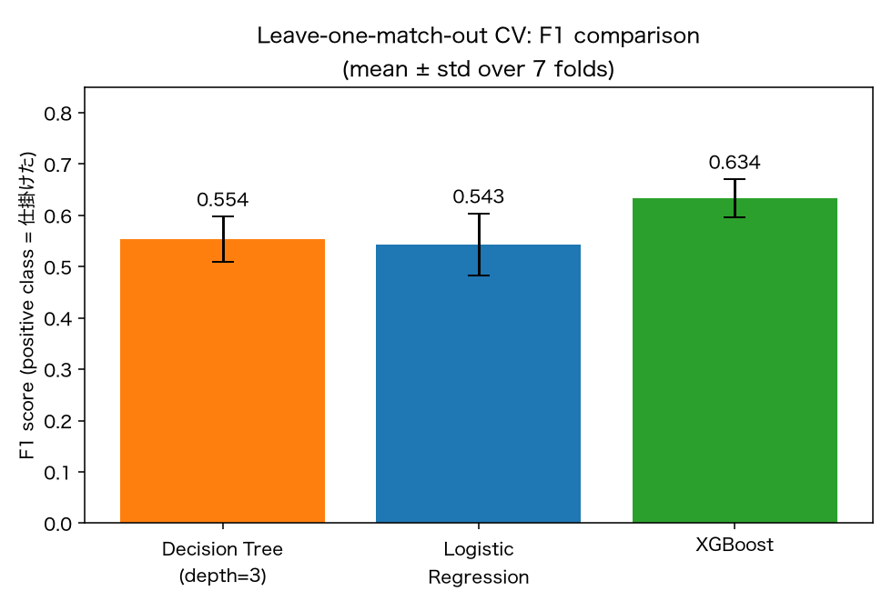
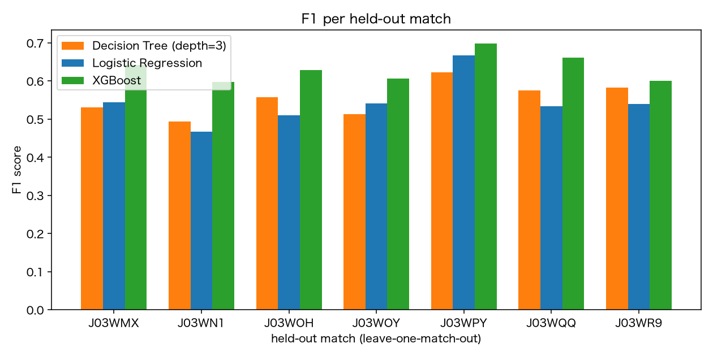
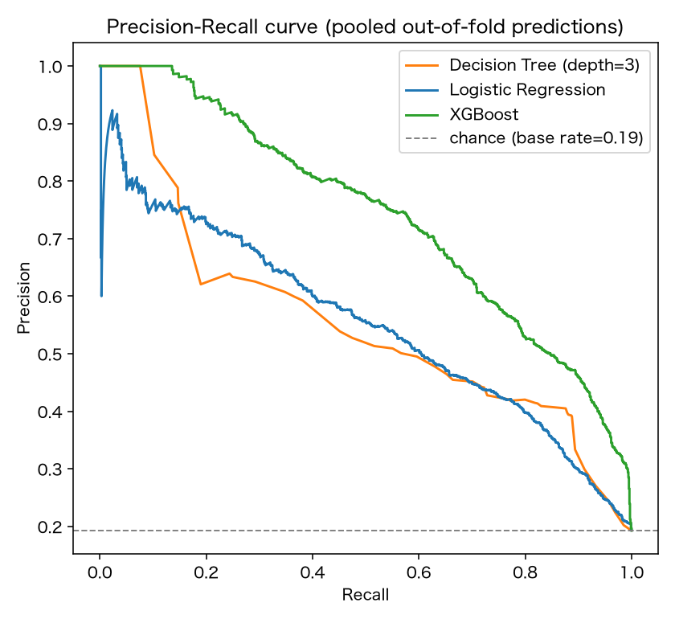
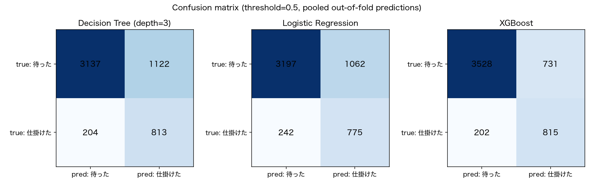
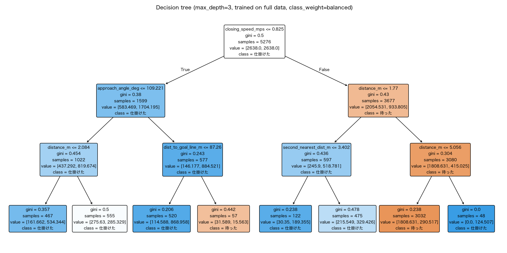
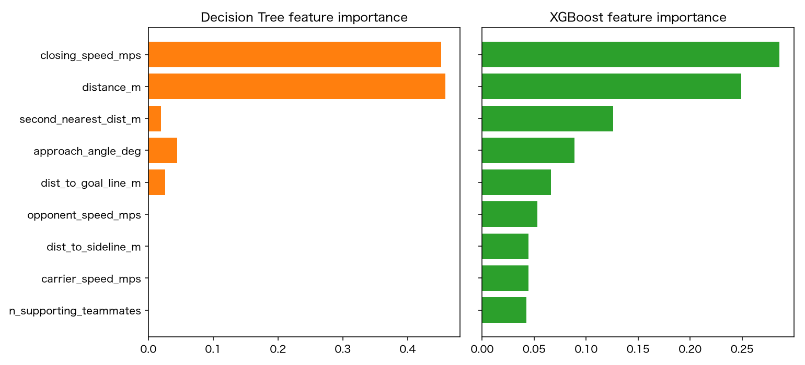

# フェーズ2: 決定木・強ベースライン評価結果

`research_plan.md` フェーズ2(決定木および強ベースラインの構築)の結果と分析。
対象タスクは1v1デュエル判定(仕掛ける=1 / 待った=0)、データは `data/tackling_features.csv`
(正例1,064件・負例4,259件のうち、同期誤差の疑いが強い`sync_error_suspect`行47件を除外した5,276件)。
評価は試合単位の交差検証(leave-one-match-out, 7 fold)、指標はF1スコア(正例=仕掛けたに対して)。

比較対象は以下の3モデル:

- **決定木(max_depth=3)**: 解釈可能性重視のベースライン(`class_weight="balanced"`)
- **ロジスティック回帰**: 線形の強ベースライン(`class_weight="balanced"`)
- **XGBoost**: 非線形の強ベースライン(`scale_pos_weight`でクラス不均衡を補正)

---

## 0. 実験条件(`scripts/train_baselines.py`)

### 0.1 入力特徴量(9列、`FEATURE_COLUMNS`)

`distance_m`, `approach_angle_deg`, `carrier_speed_mps`, `opponent_speed_mps`,
`closing_speed_mps`, `second_nearest_dist_m`, `n_supporting_teammates`,
`dist_to_sideline_m`, `dist_to_goal_line_m`

生の`carrier_x`/`carrier_y`座標は含めない(位置情報は`dist_to_sideline_m`/`dist_to_goal_line_m`という
派生特徴量のみを使用し、ピッチ座標そのものへの過学習・チーム/試合固有のフォーメーション癖の学習を避けるため)。

### 0.2 前処理

- `data/tackling_features.csv`から`sync_error_suspect`(distance_m > 10mの同期誤差疑い、47件)を除外 → 5,276行
- 欠損値(`approach_angle_deg`の数件のNaN)は`SimpleImputer(strategy="median")`で中央値補完
- 各モデルは`sklearn.pipeline.Pipeline`として、`impute`(+ロジスティック回帰のみ`StandardScaler`)→ `clf`の順に構成

### 0.3 モデルごとのハイパーパラメータ

```python
# 決定木
DecisionTreeClassifier(max_depth=3, class_weight="balanced", random_state=0)

# ロジスティック回帰
LogisticRegression(class_weight="balanced", max_iter=1000)
# 前段にStandardScalerを追加

# XGBoost
XGBClassifier(
    n_estimators=200,
    max_depth=4,
    learning_rate=0.05,
    scale_pos_weight=n_neg/n_pos,  # 学習foldのクラス比から算出
    eval_metric="logloss",
    random_state=0,
)
```

- `max_depth=3`は`research_plan.md` 3.2節に明記された「決定木(max_depth=3程度)」の指定に合わせた
- `class_weight="balanced"`(決定木・ロジスティック回帰)と`scale_pos_weight`(XGBoost)は
  いずれも正例:負例 ≈ 1:4 のクラス不均衡を補正するための調整で、対応する考え方だが実装方法が異なる
  (3.5節・3.3節参照)

### 0.4 評価方法

- **分割**: 試合単位のleave-one-match-out交差検証(7試合 × 1試合をテスト、残り6試合で学習の7fold)。
  `research_plan.md` 3.3節「データ分割」が指摘する同一試合内でのリーク(イベント単位分割の場合に起こりうる)を回避するため。
- **指標**: F1スコア(正例=「仕掛けた」に対して)を主指標とし、precision/recallも併記
- **集計**: 7fold分のF1/precision/recallの平均値±標準偏差

---

## 1. 結果の表

| モデル | F1 (mean ± std) | Precision (mean ± std) | Recall (mean ± std) |
|---|---|---|---|
| 決定木(depth=3) | 0.554 ± 0.044 | 0.429 ± 0.060 | 0.795 ± 0.062 |
| ロジスティック回帰 | 0.543 ± 0.061 | 0.425 ± 0.060 | 0.758 ± 0.081 |
| **XGBoost** | **0.634 ± 0.037** | **0.528 ± 0.044** | 0.797 ± 0.049 |

fold別のF1スコア(held-out match):

| held-out match | 決定木 | ロジスティック回帰 | XGBoost |
|---|---|---|---|
| J03WMX | 0.531 | 0.544 | 0.642 |
| J03WN1 | 0.494 | 0.467 | 0.598 |
| J03WOH | 0.557 | 0.510 | 0.629 |
| J03WOY | 0.512 | 0.540 | 0.607 |
| J03WPY | 0.623 | 0.667 | 0.698 |
| J03WQQ | 0.574 | 0.533 | 0.662 |
| J03WR9 | 0.583 | 0.539 | 0.600 |

---

## 2. 可視化

### 2.1 モデル別F1比較



### 2.2 試合ごとのF1



XGBoostは**7試合全てで**決定木・ロジスティック回帰を上回っている。特定の試合だけで勝っているのではなく、一貫した優位性であることが分かる。

### 2.3 Precision-Recall曲線(集約out-of-fold予測)



### 2.4 混同行列(閾値0.5)



### 2.5 決定木(max_depth=3, 全データ学習, 可視化用)



### 2.6 特徴量重要度(決定木 vs XGBoost)



---

## 3. 分析

### 3.1 XGBoostが一貫して優位

F1スコアはXGBoost(0.634)が決定木(0.554)・ロジスティック回帰(0.543)を約0.08〜0.09ポイント上回った。
2.2節の通り7試合全てでXGBoostが最良であり、特定試合のばらつきによる偶然ではない。
2.3節のPR曲線でもXGBoostの曲線は他の2モデルを再現率のほぼ全域で上回っており、
「たまたま閾値0.5が良かった」のではなく、確率順位付けそのものが優れていることが分かる。

これは`research_plan.md` 2節の仮説(a)「LLM骨格が決定木に対して性能面で優位に立てるか」の
比較対象として想定通りの構図を作れたことを意味する。**この0.08〜0.09ポイントのF1差、
および決定木がXGBoostに劣後する具体的な理由(3.2節)こそが、フェーズ3でLLM骨格が
埋められるかを検証すべきギャップ**である。

### 3.2 決定木がXGBoostに劣る理由: 軸並行分割の限界が数値で確認できた

2.6節の特徴量重要度を見ると、決定木(depth=3)は7分岐しかないため実質的に
`closing_speed_mps`・`distance_m`の2特徴量でほぼ全ての分岐を使い切っており、
`opponent_speed_mps`・`dist_to_sideline_m`・`carrier_speed_mps`・`n_supporting_teammates`は
重要度ゼロ(一度も分岐に使われない)。一方XGBoostは9特徴量全てに重要度が分散しており、
`second_nearest_dist_m`(空間的余裕)や`opponent_speed_mps`(相手の勢い)といった
弱いが有効な特徴量を複数組み合わせて予測に活かしている。

これは`research_plan.md` 1.2節で指摘した決定木の限界(1. 軸並行分割の限界、2. 貪欲な分割による近視眼性)が
実データで裏付けられた形である。「間合い(distance_m)」のような単独では強い特徴量に分岐を独占され、
「後方サポート人数」のような単独では弱いが組み合わせで効く特徴量が拾われていない。
**LLMが骨格として複合条件(例: 間合い×後方サポート×相手の勢い)を最初から提案できれば、
depth=3という浅い木の制約下でもXGBoスト相当の情報を数分岐に凝縮できる可能性がある** —
これがフェーズ3で検証すべき具体的な期待である。

### 3.3 Precisionの低さは全モデル共通の課題

2.4節の混同行列の通り、全モデルでprecisionが0.43〜0.53と低く、
「見送った」を「仕掛けた」と誤判定するfalse positiveが多い
(決定木1,122件、ロジスティック回帰1,062件、XGBoost731件 / いずれも真の負例4,259件中)。
これは`class_weight="balanced"`・`scale_pos_weight`によって少数派の正例(約1:4)を
見逃さない方向に調整した結果であり、意図的なトレードオフではあるが、
XGBoostはこの調整下でもfalse positiveを他の2モデルよりかなり抑えられている
(1,122→731、約35%減)点は特筆できる。

一方でrecall(真の正例のうち何件拾えたか)は3モデルともほぼ同水準(0.76〜0.80)であり、
XGBoostのF1優位は主に**precisionの改善**(false positiveの削減)から来ている。
つまりXGBoostは「仕掛けた」を見逃す割合はさほど変えず、「待った」を「仕掛けた」と
誤検知するケースを減らすことに成功している。

### 3.4 決定木の分岐自体は戦術的に解釈しやすい

2.5節の決定木を見ると、上位の分岐は以下のように読める:

- ルート: `closing_speed_mps <= 0.825` — 間合いが詰まる速さが遅い(受け手側が積極的に距離を詰めていない)かどうかで大きく分岐
- 左側(間合いが詰まっていない): `approach_angle_deg <= 109.221` — 相手が正面から向かってきているかどうかでさらに分岐、正面に近いほど「仕掛けた」側に倒れる
- 右側(間合いが急速に詰まっている): `distance_m <= 1.77` — 至近距離ならほぼ「仕掛けた」、そうでなければ`second_nearest_dist_m`(2番目に近い相手との距離、空間的余裕)で分岐

この読みやすさ自体は`research_plan.md` 2節の仮説(b)(解釈可能性)にとって好材料だが、
3.2節で見た通りこの木はXGBoostが使っている情報の一部しか活用できていない。
「解釈しやすいが情報量が少ない決定木」と「情報量は多いが解釈しにくいXGBoost」という
明確なトレードオフが定量的に確認できたことが、このフェーズの最大の成果である。

### 3.5 今回のベースラインの留保事項

- `sync_error_suspect`(distance_m > 10mの正例、47件)を除外して評価した。含めた場合の影響は未検証。
- 決定木・ロジスティック回帰の`class_weight="balanced"`とXGBoostの`scale_pos_weight`は
  異なる調整方法であり、閾値の選び方次第でF1差が縮まる可能性がある(3.3節のPR曲線で
  全域比較しているためこの懸念はある程度緩和されている)。
- 7試合・5,276サンプルと小規模なため、fold間のF1標準偏差(±0.04〜0.06)は無視できない大きさである。

---

## 4. 次のステップ

フェーズ3(LLMハイブリッドパイプライン)で検証すべき具体的な問い:

1. LLMが生成する骨格(If-Then構造)は、3.2節で確認した「depth=3の決定木が拾えない特徴量の組み合わせ」
   (例: `second_nearest_dist_m`と`opponent_speed_mps`の複合条件)を提案できるか
2. その骨格に閾値フィッティングを行った結果のF1は、XGBoostの0.634にどこまで近づけるか、
   あるいは決定木の0.554をどれだけ超えられるか
3. 3.4節で見た決定木の「読みやすさ」を維持したまま、3.2節の情報量ギャップを埋められるか
