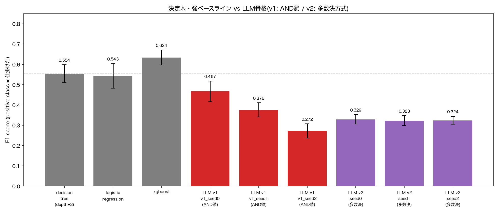

# フェーズ3(第1〜2ラウンド): LLM骨格生成の結果

`research_plan.md` フェーズ3(LLMハイブリッドパイプライン実装)の途中経過。
LLM(Claude Sonnet 5)に1v1デュエル判定の「ルールの骨格(If-Then構造)」をコード生成させ、
生成された骨格の閾値パラメータをデータに最適化した上で、[フェーズ2](phase2_baseline_results.md)の
決定木・強ベースラインとF1スコアを比較した。2回のプロンプト設計を試し、いずれも
決定木(F1=0.554)・XGBoost(F1=0.634)を上回れなかった。この2回の失敗のパターンが
対照的で示唆に富むため、一旦区切りとして結果を記録する。

---

## 1. 実験条件

### 1.1 LLM骨格生成(`scripts/generate_skeleton.py`)

- モデル: `claude-sonnet-5`(thinking無効化。理由は2.3節参照)
- 各バージョンにつき3回生成(`seed0`〜`seed2`。真の乱数シード固定ではなく、API呼び出しを3回繰り返した結果)
- プロンプトには9特徴量の説明(単位・戦術的意味)、タスク説明、出力フォーマット指定を含む
- 出力は「`PARAM_SPECS`辞書(パラメータ名と探索範囲)」+「`predict_take_on(f, p)`関数」の
  Pythonコードブロック1個に固定

### 1.2 パラメータ最適化(`scripts/fit_skeleton.py`)

- 手法: ランダムサーチ(学習データでF1最大化、400反復)+ 座標降下法による局所精緻化(最大5ラウンド)
  ※進化計算(GA/CMA-ES等)ではない
- 評価: フェーズ2と同じ試合単位leave-one-match-out交差検証(7 fold)。学習6試合でパラメータ最適化し、
  held-out試合でF1を評価
- 生成コードの実行は制限された`__builtins__`(`abs`/`min`/`max`/`bool`/`int`/`float`/`len`のみ)でexecし、
  例外発生時は「仕掛けない(0)」を返すフェイルセーフ・ラッパーで保護(research_plan.md 3.3節に対応)

### 1.3 v1プロンプト: 制約なし(素朴な複合条件)

タスク説明と出力フォーマットのみを与え、「複数の特徴量を組み合わせたIf-Then構造」を作るよう指示。
結果として3骨格とも戦術概念名つきのbool変数を`and`/`or`で組み合わせる書き方になったが、
**3〜4個の条件を直列にANDで繋ぐ**構造が多かった(例: `defender_engaged and favorable_space and high_reward_zone and not risky_position`)。

### 1.4 v2プロンプト: フェーズ2の知見+失敗パターンを明示

v1の結果を踏まえ、プロンプトに以下を追加した:

- フェーズ2の決定木・XGBoostの実際のF1スコア(0.554 / 0.634)
- 決定木の分岐が`distance_m`と`closing_speed_mps`の2特徴量にほぼ独占されていたこと
- v1で観測した「AND連鎖が長いほどrecallが崩壊する」という失敗の具体的な数値
- 代替案として「(a)複数の戦術シグナルの多数決/スコア方式」「(b)浅いAND(高々2条件)+ORの並列パターン」を提案し、
  3個以上の単純なAND連鎖は避けるよう明示的に指示

3骨格とも指示通り(a)の多数決方式(bool変数の合計が`min_votes`以上で仕掛けると判定)を採用した。

---

## 2. 結果

### 2.1 比較表

| モデル | F1 (mean ± std) | Precision (mean ± std) | Recall (mean ± std) |
|---|---|---|---|
| 決定木(depth=3) | 0.554 ± 0.044 | 0.429 ± 0.060 | 0.795 ± 0.062 |
| ロジスティック回帰 | 0.543 ± 0.061 | 0.425 ± 0.060 | 0.758 ± 0.081 |
| **XGBoost** | **0.634 ± 0.037** | 0.528 ± 0.044 | 0.797 ± 0.049 |
| LLM v1 seed0(AND鎖) | 0.467 ± 0.051 | 0.385 ± 0.055 | 0.598 ± 0.062 |
| LLM v1 seed1(AND鎖) | 0.376 ± 0.035 | 0.380 ± 0.046 | 0.375 ± 0.044 |
| LLM v1 seed2(AND鎖) | 0.272 ± 0.035 | 0.269 ± 0.043 | 0.279 ± 0.036 |
| LLM v2 seed0(多数決) | 0.329 ± 0.023 | 0.201 ± 0.017 | 0.922 ± 0.014 |
| LLM v2 seed1(多数決) | 0.323 ± 0.024 | 0.195 ± 0.017 | 0.950 ± 0.017 |
| LLM v2 seed2(多数決) | 0.324 ± 0.020 | 0.194 ± 0.014 | 1.000 ± 0.000 |

### 2.2 可視化

生成コード: `llm_skeletons/v1_and_chain/skeleton_seed{0,1,2}.py`(v1)、`llm_skeletons/skeleton_seed{0,1,2}.py`(v2)。
数値の再現: `documents/llm_skeleton_results_v1.csv`、`documents/llm_skeleton_results.csv`。

---

## 3. 分析: 対照的な2つの失敗パターン

### 3.1 v1(AND連鎖): precisionはそこそこ、recallが崩壊

v1で最良だったseed0(F1=0.467)は`and`/`or`を織り交ぜた比較的緩い構造だったが、
seed1・seed2は3〜4条件の直列AND(`A and B and (C or D) and not E`のような形)が中心だった。
AND連鎖はすべての条件が同時に真でなければ正例と判定されないため、個々の閾値が
実データと少しでもズレると正例を取りこぼす。実際、seed2のrecallは0.279まで落ち込み、
決定木の0.795を大幅に下回った。**条件を厳しくするほど「疑わしきは仕掛けないと判定する」
方向に倒れ、見逃しが増える**という直感的にも理解しやすい失敗である。

### 3.2 v2(均等多数決): recallは満点近いが、precisionが基準率まで低下

v2はv1の反省を踏まえ「複数条件のうちN個以上が真なら仕掛ける」という多数決方式にしたが、
今度は逆にrecallが0.92〜1.00(ほぼ全ての正例を拾う)まで上がった一方、precisionは0.19〜0.20まで
低下した。これは全体の正例率(基準率)とほぼ同じ値であり、**「ほぼ常に仕掛けると予測する」
退化解にほぼ等しい**ことを意味する(この場合の理論値: precision≈0.2、recall≈1.0のときF1=2×0.2×1/1.2≈0.33で、
実測の0.32〜0.33と一致)。

原因は、多数決方式が各条件を**均等に**1票として扱っていることにある。`distance_m`・`closing_speed_mps`
のような強い予測力を持つ特徴量も、`is_carrier_faster`(相手より速いか)のような単独では
ほぼ無関係に近い特徴量も同じ1票として合算されるため、最適化(`min_votes`の調整)は
「弱い特徴量のノイズに埋もれた強い信号」を活かせず、結局「ほぼ全部の条件が緩やかに満たされやすい
低い閾値」に収束してしまった。

### 3.3 示唆: 「構造の骨格」だけでなく「重みづけ」が必要

2つの失敗は対称的である: AND連鎖は「厳しすぎる合成(論理積)」、均等多数決は
「弱すぎる合成(重みなし総和)」。フェーズ2で確認した通り、XGBoostが決定木に勝る理由は
9特徴量全てに**重要度の差をつけて**組み合わせている点にあった。今回のv1・v2はいずれも
「どの特徴量が強いか」を骨格の構造(AND/ORの結線)だけで表現しようとしており、
**重みという次元を持たない**点で共通の限界がある。

次に試すべき自然な方向性は、多数決方式に「各条件の重み」もパラメータとして持たせる
(例: `votes = w1*is_tight_space + w2*is_closing_fast + ...`、`sum(votes) >= threshold`)ことで、
最適化が「distance_mとclosing_speed_mpsの重みを大きく、弱い特徴量の重みを小さく」学習できる
余地を作ることだろう。これは事実上、決定木とXGBoostの中間(手動で骨格を作るが、重みは
データから学習するロジスティック回帰に近い構造)にあたり、フェーズ3の設計として
検証する価値がある。

---

## 4. コストメモ

API呼び出しは合計6回(v1: 3回、v2: 3回)、実測入力トークン(`count_tokens`による正確な値)と
生成コード長からの推定出力トークンに基づく概算で、**合計約$0.10(Claude Sonnet 5, $2/$10 per 1Mトークン)**。

---

## 5. 未検証・保留事項

- 重み付き多数決方式は未実装・未検証(3.3節の提案)
- v1・v2とも「複数シードでの安定性」は3回のみで確認しており、research_plan.md 3.3節が
  求める安定性確認としては最小限
- LLM骨格のパラメータ最適化(ランダムサーチ+座標降下法)自体の探索力が、
  決定木・XGBoostの学習アルゴリズムと比べて見劣りする可能性(最適化手法の限界と
  骨格構造の限界が結果に混在しており、まだ分離できていない)
