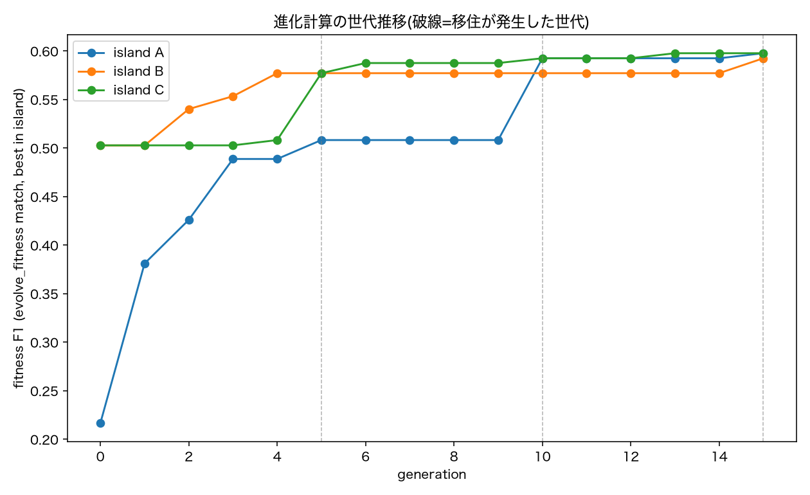

# フェーズ3拡張: Island型進化計算によるLLM骨格探索の結果

`research_plan.md`フェーズ3の拡張。[単発生成(v1/v2)](phase3_llm_skeleton_results.md)がいずれも
決定木・XGBoostを超えられなかったことを受け、LLMをmutation/crossoverオペレータとする
island型GAで複数世代にわたって骨格を改良した。実装計画は`documents`外([セッションのplanファイル](../../../.claude/plans/twinkly-wishing-torvalds.md)、
リポジトリ管理外)にあるため、ここでは実行結果と分析のみをまとめる。

---

## 0. 生成されたルールベースコードの場所

### 進化計算(本ドキュメントの結果)

| 内容 | パス |
|---|---|
| 最終ベスト個体のコード全文 | `evolution_runs/20260908_205621/best_individual.py`(3.4節に掲載した`ind90`そのもの) |
| 全個体の履歴(95件、1行=1個体) | `evolution_runs/20260908_205621/population.jsonl`(JSON Lines。各行の`code`列にコード全文、`id`/`island`/`method`/`fitness_f1`等も同じ行に記録) |
| 実行設定(試合割り当て等) | `evolution_runs/20260908_205621/run_config.json` |
| held-out評価結果 | `evolution_runs/20260908_205621/held_out_evaluation.json` |

特定条件の個体(例: 「island Bの交叉個体だけ」等)を`population.jsonl`から抽出したい場合は
`pandas.read_json(path, lines=True)`等でフィルタできる。

### 単発生成(v1/v2、[phase3_llm_skeleton_results.md](phase3_llm_skeleton_results.md)の結果)

| バージョン | コード | プロンプト |
|---|---|---|
| v1(AND連鎖) | `llm_skeletons/v1_and_chain/skeleton_seed{0,1,2}.py` | `llm_skeletons/v1_and_chain/prompt.txt` |
| v2(均等多数決) | `llm_skeletons/skeleton_seed{0,1,2}.py` | `scripts/generate_skeleton.py`内の`build_prompt()` |

---

## 1. 実験条件

### 1.1 データ分割(単一train/evolve/test分割)

7試合を固定シード(`random.Random(42)`)でランダムに割り当てた(恣意的選定を避けるため):

| 役割 | 試合 | 用途 |
|---|---|---|
| `evolve_train` | J03WN1, J03WOY, J03WQQ, J03WR9(4試合) | 個体ごとのパラメータ最適化(`fit_skeleton.optimize_params`と同じランダムサーチ+座標降下法) |
| `evolve_fitness` | J03WPY(1試合) | 適応度(選択圧に使うF1)の評価 |
| `held_out_test` | J03WMX, J03WOH(2試合) | 進化ループには一切使わず、最終報告専用 |

### 1.2 Island構成・個体表現

- 3 island(A/B/C)× 4個体 = 12個体でスタート。個体表現はv1/v2と同一
  (`PARAM_SPECS`辞書 + `predict_take_on(f, p)`関数のコード文字列)
- 初期生成プロンプトはislandごとに着想の起点のみ変えた(フェーズ2の決定木・XGBoostの結果は
  一切見せない、診断情報ゼロで開始):
  - **Island A**: v1と同一プロンプト(自由生成)
  - **Island B**: 「複数の判定パターンをいずれか1つでも満たせば仕掛けると判定する形で」という着想のみ追加
  - **Island C**: 「まず大まかな基準で分け、その中でさらに詳しく判断する」という段階的着想のみ追加

### 1.3 選択・交叉・突然変異

- 各世代、island内(4個体)でF1上位2個体をエリート保存、残り2枠を突然変異1体+交叉1体で新規生成
  (3 island × 2新規 = 1世代あたり6個体)
- 突然変異・交叉のプロンプトには、親個体のコード全文とF1/Precision/Recallの**数値のみ**を渡し、
  「なぜスコアが悪いか」といった診断コメントは一切含めない
- 交叉の親2体は同一island内でトーナメント選択(ランダム3個体から最良を選出)

### 1.4 移住・終了条件

- 5世代ごとに、各islandの最良個体を次island(リング状: A→B→C→A)の最劣個体と入れ替え
- 終了条件: 最大15世代、または全island中の最良fitnessが直近5世代改善しなければ早期終了
  (実際には15世代まで一度も5世代以上停滞せず、上限まで完走した)

---

## 2. 結果

### 2.1 進化の世代推移

破線は移住が発生した世代(5, 10, 15)。island Aは初期値が低かった(F1=0.217)が、
移住を経て最終的に他islandに追いつき、15世代終了時点で3island全て F1≈0.59〜0.60 に収束した。

### 2.2 最終結果と比較

進化ループ内の適応度(evolve_fitness、単一試合)で最良だったのは`ind90`(island C、交叉個体、
fitness_f1=0.598)。この個体を`evolve_train`+`evolve_fitness`(5試合)で再フィッティングし、
一度も進化ループに触れさせていない`held_out_test`(2試合)で最終評価した。

| 指標 | 値 |
|---|---|
| 適応度(evolve_fitness 1試合、選択に使った値) | F1 = 0.598 |
| 5試合再フィッティング後の同5試合上でのF1 | F1 = 0.497 |
| **held-out 2試合(pooled)** | **F1 = 0.491**, Precision = 0.397, Recall = 0.644 |
| held-out内訳: J03WMX | F1 = 0.506 |
| held-out内訳: J03WOH | F1 = 0.471 |

他手法との比較(決定木・XGBoost・v1/v2は7-fold leave-one-match-out平均、進化計算は
held-out 2試合のpooled値 — **評価プロトコルが異なる点に注意**、3.3節参照):

| モデル | F1 | |
|---|---|---|
| 決定木(depth=3) | 0.554 | ← LLM/進化計算の公平な比較対象 |
| ロジスティック回帰 | 0.543 | ← 同上 |
| XGBoost | 0.634 | 参考値(単一モデル vs アンサンブルのため比較対象外、[depth_sweep_results.md](depth_sweep_results.md)) |
| LLM v1 最良(seed0) | 0.467 | |
| LLM v2 最良(seed0) | 0.329 | |
| **進化計算 最良個体(held-out 2試合)** | **0.491** | |

---

## 3. 分析

### 3.1 単発生成(v1/v2)は明確に上回った

進化計算のheld-out F1(0.491)は、v1の最良(0.467)・v2の最良(0.329)をいずれも上回った。
特にv2(均等多数決、precision崩壊)のような退化解には陥っておらず、held-out側の
precision(0.397)・recall(0.644)のバランスもv1の最良個体(precision0.385/recall0.598)と
近い水準を保っている。世代を重ねて数値フィードバックだけで反復改善する枠組みが、
単発生成より安定して「実用的なバランス」に到達できることが確認できた。

### 3.2 決定木にはまだ届かない(XGBoostとの比較は対象外)

held-out F1(0.491)は決定木(0.554、7-fold平均)にも届いていない。ここでの適切な比較対象は
決定木・ロジスティック回帰であり、**XGBoostとの比較はそもそも対象外**である
([depth_sweep_results.md](depth_sweep_results.md)参照): 決定木のmax_depth制約を外しても
XGBoost(0.634)には追いつかず(depth=8でピークF1=0.590、それ以上は過学習で悪化)、この差は
「決定木というアルゴリズムが複合条件を表現できないこと」よりも「単一モデル vs 200本の木の
アンサンブル」という手法クラスの違いに由来する可能性が高いとわかった。進化計算の個体も
LLM骨格と同じ「単一のルールセット」であり、公平な比較対象は同じ単一モデルクラスに属する
決定木・ロジスティック回帰(F1≈0.55)である。

なお、進化計算の数値は試合2つだけのpooled評価(単一点推定)であり、決定木の7-fold平均とは
分散の大きさが全く異なる点に注意が必要(2.2節)。それでも、5試合再フィッティング後の値
(F1=0.497)がheld-out(0.491)とほぼ一致していることは、この個体の性能がおおむね妥当に
見積もられている(過度に楽観的な数字ではない)ことを裏付けている。

### 3.3 適応度(0.598)とheld-out(0.491)の差 — 単一検証試合への過適合

進化ループの選択に使った適応度(evolve_fitness、単一試合でのF1=0.598)と、
5試合再フィッティング後の値(0.497)・held-out値(0.491)の間には約0.10ポイントの差がある。
これは、95体以上の個体を単一の検証試合(1試合、対象イベント数はたかだか150〜200件程度)に
対して15世代にわたって選択し続けたことによる、**適応度そのものへの過学習**が原因と考えられる。
これはユーザーが当初の設計で「理想形」として位置づけていた完全ネストCV(外側7-foldそれぞれで
独立に進化ループを回す)が本来解決すべき課題そのものであり、今回の単一分割による結果は
「進化計算というアプローチ自体が有望かどうか」の一次スクリーニングとしては十分機能したが、
**最終的な性能の正確な見積もりにはまだ使えない**ことを示している。

### 3.4 最良個体の構造: 単一系統(B起源)が移住で広まった「複数パターンのOR」

`ind90`(evolution_runs/20260908_205621/best_individual.py)は、6つの名前付きパターン
(`pattern_committed_defender`、`pattern_supported_isolation`、`pattern_attacking_third_opportunity`、
`pattern_exploit_retreating_defender`、`pattern_desperate_sideline_escape`、`pattern_tight_space_favorable`)
をそれぞれ3〜5条件のANDで構成し、それらをORで並列に組み合わせる構造になっていた。

これは[v2のプロンプト](phase3_llm_skeleton_results.md)で明示的に提案した
「(b) 浅いAND(高々2条件)+ORによる複数の経路」に近い構造だが、**今回のisland A/B/Cの
初期プロンプトにはこの提案(PRIOR_FINDINGS)を一切含めていない**。

ただし3.4.2節の系譜追跡で確認した通り、この構造は複数islandが**独立に**辿り着いたものではない。
`ind90`の系譜を遡ると`ind90 → ind71 → ind48 → ind34`となり、`ind34`はisland Bで世代4に
生まれた個体である。island A(v1相当のプロンプト)の移住前ベスト個体(`ind25`、fitness_f1=0.489)
は明確に異なる構造をしており、この「複数パターンのOR」はislandごとに独立発生したのではなく、
**island Bで生まれた単一の系統が、世代5の移住でisland Cへ伝播し、その後island C内での交叉を
経て最終的に全islandへ広まった**、というのが実態である。したがって「複数の初期着想(A/B/C)が
独立にこの構造へ収束した」という主張はできない。示せるのは、この構造がひとたび生まれれば
数値フィードバックだけの選択圧のもとで生き残り・優勢になったという点のみであり、その生存が
構造自体の妥当性によるものか、単に最初に高いfitnessを引き当てた系統が複製で増えただけか
(遺伝的浮動に近い現象)は、この1回の実行だけでは判別できない。

#### 3.4.1 ルールの読み解き(held-out評価で使用した再フィッティング後のパラメータ)

コードの変数名だけでは意味が追いにくいため、`analyze_evolution.py`が5試合
(`evolve_train`+`evolve_fitness`)で再フィッティングした実際のパラメータ値を当てはめて解説する
(この値が2.2節のheld-out F1=0.491を出したときに使われたもの)。

まず中間変数(bool)の意味:

| 変数 | 条件(実際の数値) | 意味 |
|---|---|---|
| `is_tight_space` | 間合い < **1.52m** | 相手にかなり詰められている |
| `is_head_on_approach` | 進入角度 < **55.5°** | 相手がほぼ正面から向かってきている |
| `is_closing_fast` | 間合いの詰まる速さ > **1.94 m/s** | 相手が急速に距離を詰めている |
| `is_opponent_retreating` | 間合いの詰まる速さ < 0 | 相手がむしろ下がっている(様子見) |
| `has_space_after_beat` | 2番目に近い相手 > **2.00m** | 1人抜いた後の逃げ場が十分ある |
| `has_some_space_after_beat` | 同上 > **1.30m**(緩め) | 逃げ場がそこそこある |
| `has_support` | 後方サポート人数 ≥ **1人**(実質) | 味方のフォローがある |
| `is_pinned_to_sideline` | タッチラインまで < **1.0m** | サイドに追い込まれている |
| `is_in_attacking_third` | ゴールまで < **17.6m** | 敵陣深く(アタッキングサード) |
| `carrier_faster_than_opponent` | 保持者の速度 > 相手の速度 | スピードで優位 |

6つの「仕掛けるパターン」(いずれか1つでも成立すれば仕掛ける、OR結合):

1. **`pattern_committed_defender`(正対突撃を迎え撃つ)**: 間合いが詰まり、相手が正面から
   急接近している。それでも抜けた後のスペースがあり、サイドにも詰まれていない
   → 「来るなら受けて立って抜く」
2. **`pattern_supported_isolation`(孤立しても保険あり)**: 間合いは詰まっているが、
   抜けた後のスペースと味方サポートの両方があり、サイドにも詰まれていない
   → 「1対1で負けても後ろが拾ってくれる」
3. **`pattern_attacking_third_opportunity`(敵陣深くのスピード優位)**: ゴールまで17.6m未満に
   いて、多少のスペースがあり、自分の方が速い(サイドさえ詰まれていないか、サポートがあれば
   間合いの条件は問わない) → 「ここで仕掛けないと勿体ない」
4. **`pattern_exploit_retreating_defender`(下がる相手を突く)**: 相手が間合いを詰めてこず
   後退している。スペースがあり、サイドにも詰まれておらず、サポートかスピード優位のどちらか
   がある → 「相手が引いているなら前進する」
5. **`pattern_desperate_sideline_escape`(サイドで追い込まれても脱出)**: タッチライン際に
   追い込まれ間合いも詰まっているが、相手はまだ急接近しておらず、味方サポートとスピード優位が
   両方揃っている → 「本来危険な状況だが、条件が揃えば強行突破」
6. **`pattern_tight_space_favorable`(総合的に有利なら仕掛ける、汎用パターン)**: 間合いは
   詰まっているが、サイドに詰まれておらず、自分の方が速く、かつ(スペースか味方サポートの
   どちらか)がある → 「間合いの近さだけで判断せず、速さと保険で総合判断」

**全体としての読み方**: 6パターンに共通するのは、ほぼ全てが「間合いが詰まっている
(または相手が下がっている/敵陣深い)」+「何らかの安全弁(逃げ場のスペース・味方サポート・
スピード優位・サイドに詰まれていない)」という組み合わせであることである。「間合いが近い」の
一言だけでは仕掛けず、必ず何かしらの保険条件とセットで判断している点が、決定木
(`distance_m`と`closing_speed_mps`の2つだけで大半の分岐を作っていた、フェーズ2 3.2節参照)との
違いである。⑤だけが例外的に「サイドに追い込まれている」という通常はネガティブな条件を、
他の好条件(サポート+スピード優位)が揃えば許容する、という一段複雑な判断になっている。

#### 3.4.2 系譜の確認: island Bの移住前ベスト個体は`ind90`の直接の祖先だった

`ind90`のparent_idsを`population.jsonl`から遡ると、`ind90 → ind71 → ind48 → ind34`という系譜が
確認できる。`ind34`は世代4時点でのisland Bの最良個体(交叉、fitness_f1=0.577)で、世代5の移住で
island Cへ渡り、その後island C内での交叉を経て最終的に`ind90`(fitness_f1=0.598)に進化した。
つまり、**最終的な全体ベストの骨格は実質的にisland B由来**であり、移住機構が単なる多様性維持
以上の役割(良い系統を他islandへ伝播させる役割)を果たしていたことが系譜からも裏付けられる。

`ind34`のコードは`ind90`とほぼ同じ5パターン構成(まだ`pattern_tight_space_favorable`は無く、
`pattern_committed_defender`にも「サイドに詰まれていない」条件が付いていない、よりシンプルな
バージョン)だった。進化ループ内(`evolve_train`4試合)で最適化された`ind34`のパラメータ値を
当てはめると:

| 変数 | 条件(実際の数値) | 意味 |
|---|---|---|
| `is_tight_space` | 間合い < **1.61m** | 相手にかなり詰められている |
| `is_head_on_approach` | 進入角度 < **70.0°** | 正面寄りからの接近(探索範囲10〜70°の上限に張り付いている=ほぼ無制限に近い緩い条件) |
| `is_closing_fast` | 間合いの詰まる速さ > **1.20 m/s** | 相手が急速に距離を詰めている |
| `is_opponent_retreating` | 間合いの詰まる速さ < 0 | 相手が下がっている |
| `has_space_after_beat` | 2番目に近い相手 > **2.00m** | 逃げ場がある(探索範囲2.0〜10.0mの下限に張り付いている) |
| `has_some_space_after_beat` | 同上 > **1.30m** | 逃げ場がそこそこある |
| `has_support` | 後方サポート ≥ **0人** | **実質、常にTrue**(条件が無効化されている、後述) |
| `is_pinned_to_sideline` | タッチラインまで < **2.27m** | サイドに追い込まれている |
| `is_in_attacking_third` | ゴールまで < **20.75m** | 敵陣深く |
| `carrier_faster_than_opponent` | 保持者速度 > 相手速度 | スピード優位 |

5つのパターン:

1. **`pattern_committed_defender`**: 間合いが詰まり、正面から急接近され、抜けた後にスペースが
   ある(`ind90`にある「サイドに詰まれていない」条件はまだ無い、よりシンプル)
2. **`pattern_supported_isolation`**: 間合いが詰まり、スペースがあり、サイドに詰まれていない
   (サポート条件は常にTrueなので実質無視される)
3. **`pattern_attacking_third_opportunity`**: 敵陣深く、多少のスペースがあり、スピード優位
   (OR節も常にTrueなので実質無条件)
4. **`pattern_exploit_retreating_defender`**: 相手が下がっていて、スペースがあり、サイドに
   詰まれていない
5. **`pattern_desperate_sideline_escape`**: サイドに詰まれ間合いも詰まっているが、相手は急接近
   しておらず、スピード優位がある

**`support_min_count`の無効化について**: このパラメータフィッティングでは`support_min_count`が
探索範囲の下限**0.0**に落ち着いており、「後方サポート人数 ≥ 0」は選手人数が常に0以上である以上
**常にTrue**、つまりこの条件は事実上何もチェックしていない。「後方サポート」という戦術概念を
コードには残しつつ、`evolve_train`の4試合ではこの特徴量が判別に寄与しないと最適化が判断した
ことを意味する。興味深いことに、`ind90`(5試合で再フィッティング後、3.4.1節)では同じ
`support_min_count`が**0.578**(実質「1人以上」を要求)に変わっている。同じコード構造でも、
どのデータで最適化するかによってパラメータの実質的な意味が大きく変わりうる、という
好例になっている。

#### 3.4.3 端張り付き監査: 「実効的な複雑さ」は名目より小さい

3.4.1・3.4.2節で個別に触れた`support_min_count`の無効化は氷山の一角であり、`PARAM_SPECS`の
探索範囲(low, high, initial)と実際にフィットされた値を全パラメータで機械的に突き合わせると、
同様の「装飾的に無効化された条件」を体系的に洗い出せる。追加のLLM呼び出しは不要で、
`population.jsonl`と`held_out_evaluation.json`だけから計算できる(`scripts/audit_pinning.py`)。

`ind90`(held-out評価で使った再フィット値)を対象に、フィット値が探索範囲の端から5%以内に
入っているパラメータを機械的に抽出した結果:

| パラメータ | 探索範囲 | 再フィット値 | 端からの距離 | 判定 |
|---|---|---|---|---|
| `tight_space_distance_m` | 0.5〜5.0 | 1.52 | 22.7% | 機能中 |
| `head_on_approach_angle_deg` | 10〜70 | 55.5 | 24.2% | 機能中 |
| `high_closing_speed_mps` | 0.5〜3.0 | 1.94 | 42.2% | 機能中(中央付近) |
| `space_after_beat_distance_m` | 2.0〜10.0 | 2.00 | **0.0%** | **端に張り付き** |
| `support_min_count` | 0.0〜4.0 | 0.58 | 14.4% | 境界寄りだが機能中 |
| `sideline_danger_distance_m` | 1.0〜8.0 | 1.00 | **0.0%** | **端に張り付き** |
| `attacking_third_distance_m` | 10〜40 | 17.6 | 25.3% | 機能中 |

形式的な「端から5%以内」基準では7個中2個が該当する。この2つが実際にどれだけ判別へ寄与している
かをデータ側の発生頻度で裏付けると、以下の通り極端に偏っていた:

- `has_space_after_beat`(second_nearest_dist_m > 2.0m): 全5,276行中**98.2%でTrue**(Falseは1.8%のみ)
- パターン③が使う`has_some_space_after_beat`(> 1.3m、同じ基準パラメータの緩和版): **99.7%でTrue**
- `is_pinned_to_sideline`(dist_to_sideline_m < 1.0m): 全体の**4.3%でしかTrueにならない**
  → `not is_pinned_to_sideline`は95.7%常にTrue(ほぼ無条件)、これを要求する⑤は**発火機会が
  最大4.3%しかない**、事実上のエッジケース専用パターン

これをパターンごとの「実効条件数」に落とすと:

| パターン | 名目条件数 | 装飾的な条件 | 実効条件数 |
|---|---|---|---|
| ① committed_defender | 4 | has_space_after_beat | **3** |
| ② supported_isolation | 4 | has_space_after_beat, not_pinned | **2** |
| ③ attacking_third_opportunity | 4(OR含む) | has_some_space_after_beat, OR節全体 | **2** |
| ④ exploit_retreating_defender | 4(OR含む) | has_space_after_beat, not_pinned | **2** |
| ⑤ desperate_sideline_escape | 6 | (条件自体は生きているが発火率≤4.3%で実質死んでいる) | ほぼ0(稀なエッジケース) |
| ⑥ tight_space_favorable | 4(OR含む) | not_pinned, has_safety_netのOR全体 | **2** |

**結論**: 名目「6パターン×3〜5条件」に対し、実際に判別へ寄与しているのは実質**5パターン×2〜3条件**
程度であり、使われている特徴量も9個中`dist_to_sideline_m`・`second_nearest_dist_m`がほぼ死んでいる
(実質6特徴量相当)。特に⑤は事実上機能していない。`space_after_beat_distance_m`・
`sideline_danger_distance_m`はいずれも探索範囲の**下限**に張り付いていた。当初は
「探索範囲の設計が甘かった(下限そのものが効きやすい値を含んでいなかった)」可能性を疑ったが、
3.4.4節の追試でこの仮説は否定された。将来的に骨格の複雑さにペナルティを課す設計(4節参照)を
検討する際は、この「名目の条件数」ではなく「端張り付き監査を通した実効条件数」を基準にする方が、
ペナルティの強さを適切に調整しやすい。

#### 3.4.4 追試: 探索範囲を実データの分位点に置き換えても端張り付きは解消しなかった

3.4.3節の「探索範囲の設計が甘かった」という仮説を検証するため、`ind90`の骨格(6パターンの
コード)はそのまま、`PARAM_SPECS`の探索範囲だけを**evolve_train(4試合)のみ**のデータ分位点
(P5〜P95)から再計算し、`fit_skeleton.optimize_params`を回し直した(追加のLLM呼び出しなし、
`scripts/refit_percentile_ranges.py`)。分位点をevolve_train限定で計算したのは、
evolve_fitness/held_out_testのデータを混ぜて範囲を決めると「テストデータの分布を覗いてから
探索範囲を決めた」という新しい形のリークになり、これまで一貫して避けてきたリークの再発になる
ためである。

7パラメータ中5パラメータで探索範囲が1.9〜4.4倍に拡大した(下表):

| パラメータ | 元の範囲 | evolve_train分位点(P5〜P95) |
|---|---|---|
| `tight_space_distance_m` | (0.5, 5.0) | (0.69, 4.99) |
| `head_on_approach_angle_deg` | (10, 70) | (4.08, 153.18) |
| `high_closing_speed_mps` | (0.5, 3.0) | (-2.00, 6.21) |
| `space_after_beat_distance_m` | (2.0, 10.0) | (2.84, 17.27) |
| `support_min_count` | (0.0, 4.0) | (0.0, 4.0) |
| `sideline_danger_distance_m` | (1.0, 8.0) | (1.17, 31.71) |
| `attacking_third_distance_m` | (10, 40) | (11.9, 94.0) |

結果、性能は改善するどころか**悪化した**(held-out pooled F1: 0.491 → **0.446**、precision
0.397→0.324、recall 0.644→0.716)。

より重要なのは、端張り付きだった2パラメータの挙動である。**`space_after_beat_distance_m`は
新しい範囲(2.84〜17.27)の下限2.84そのものに、`sideline_danger_distance_m`も新しい範囲
(1.17〜31.71)の下限1.165そのものに、再び張り付いた。** つまり探索範囲を実データの分位点という
恣意性のない基準に置き換えても、最適化はこの2条件を「最も緩い(ほぼ常に真になる)」方向へ
押しやる。これは「探索範囲が悪かった」という3.4.3節の当初の仮説を否定し、**この2条件が
`ind90`の6パターン構造の中で構造的に不要とされている(範囲の較正では解決しない)**という
より強い結論を裏付ける。

ただし、この追試には交絡もある。5パラメータで探索範囲の体積が拡大した一方、
`optimize_params`の探索予算(ランダムサーチ400回+座標降下法)は変えていない。同じ予算で
より広い空間を探索すれば最適化の質が劣化するのは自然であり、今回の性能悪化(0.491→0.446)が
「範囲拡大による探索効率の低下」と「3.4.3節で述べた構造的な限界」のどちらにどれだけ起因するかは、
この1回の追試だけでは完全には切り分けられない。切り分けるには、(a)探索予算を増やして
再実行する、または(b)端張り付きだった2パラメータのみ範囲を広げ残り5個は元のまま固定する、
といった追加の追試が必要である(いずれも追加のLLM呼び出しは不要)。

### 3.5 移住の効果

進化の世代推移(2.1節)を見ると、island Aは初期集団の質が低かった(F1=0.217)にもかかわらず、
5世代目の移住でisland Cから優良個体を受け取ってF1が急上昇し、以降は他islandと同水準で
推移した。移住なしでは island A は劣った局所解に留まっていた可能性が高く、
island型GAの移住機構が実際に機能していたことが確認できる。

---

## 4. 実行統計・コストメモ

- 総LLM呼び出し回数: **102回**(初期生成12 + 15世代×6個体)、コード生成の解析失敗(SyntaxError等)は**0件**
- 実測トークン数に基づく概算コスト: 入力約25万トークン・出力約8.1万トークン(Claude Sonnet 5,
  $2/$10 per 1Mトークン)→ **約$1.3**
- ロギングの既知の欠落: 移住は「reproduction→migration→ログ記録」の順で実行されるため、
  ある世代で新規生成された個体がその世代のisland内最劣individualとして即座に移住個体で
  上書きされた場合、その個体は評価済み(LLM呼び出し・fitness計算は実施済み)にもかかわらず
  JSONLログには一度も記録されない。今回の実行では該当が7個体(`ind39, 41, 68, 69, 97, 99, 101`)
  あり、`population.jsonl`のユニーク個体数は102ではなく95件になっている。評価自体への影響はない
  (捨てられた個体は定義上いずれもその世代の最劣個体であり、最終結果には寄与しない)が、
  系譜の完全な追跡はできない。

---

## 5. 今後の検討事項

- 3.3節の通り、外側7-fold leave-one-match-out × 内側で進化ループという完全ネストCVへの拡張
  (計算コストは7倍。今回のコスト実績$1.3から見積もると約$9程度)を検討する価値がある
- 4節のロギング欠落は、`log_generation_snapshot`を`migrate`の**前**に呼ぶ(移住前の状態を
  記録してから上書きする)ことで解消できる軽微な修正
- 決定木(F1≈0.55〜0.59)との差を埋めるには、3.4節の6パターン構造をさらに世代を重ねて改良するか、
  適応度評価に使う試合を複数(例: 2〜3試合の平均)にして3.3節の過適合を緩和することが有効と考えられる
  ([depth_sweep_results.md](depth_sweep_results.md)の通り、XGBoostとの差を埋めることは
  単一モデルクラスの比較としては目標に設定しない)
